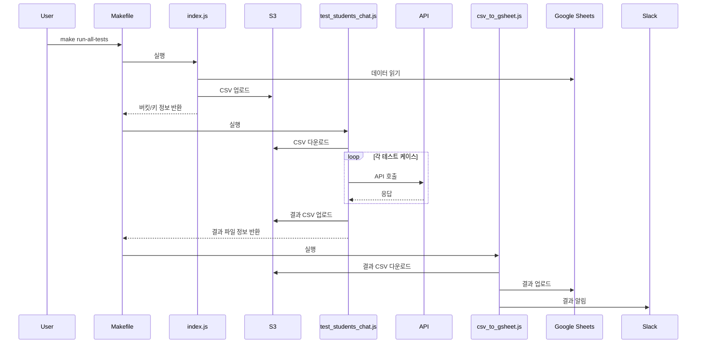

# 테스트 자동화 프로젝트

이 프로젝트는 구글 시트의 테스트 데이터를 기반으로 API 테스트를 자동화하고, 결과를 구글 시트로 업로드하는 자동화 도구입니다.

## 주요 기능

- 구글 시트에서 테스트 데이터 읽기
- S3를 통한 데이터 저장 및 관리
- API 테스트 자동화
- 테스트 결과를 구글 시트로 업로드
- Slack을 통한 결과 알림

## 프로세스 흐름



## 사용 방법

### 전체 테스트 실행
```bash
make run-all-tests
```

### 특정 테스트 실행
```bash
make run-all-tests tests="2-1 10 15"
```

### 환경 설정
`.env` 파일에 다음 환경 변수를 설정해야 합니다:
- `AWS_ACCESS_KEY_ID`: AWS 액세스 키
- `AWS_SECRET_ACCESS_KEY`: AWS 시크릿 키
- `AWS_REGION`: AWS 리전
- `S3_BUCKET`: S3 버킷 이름
- `SLACK_WEBHOOK_URL`: Slack 웹훅 URL

## 파일 구조

- `index.js`: 구글 시트 데이터를 S3에 업로드
- `test_students_chat.js`: API 테스트 실행
- `csv_to_gsheet.js`: 테스트 결과를 구글 시트로 업로드
- `Makefile`: 자동화 스크립트 실행 관리 