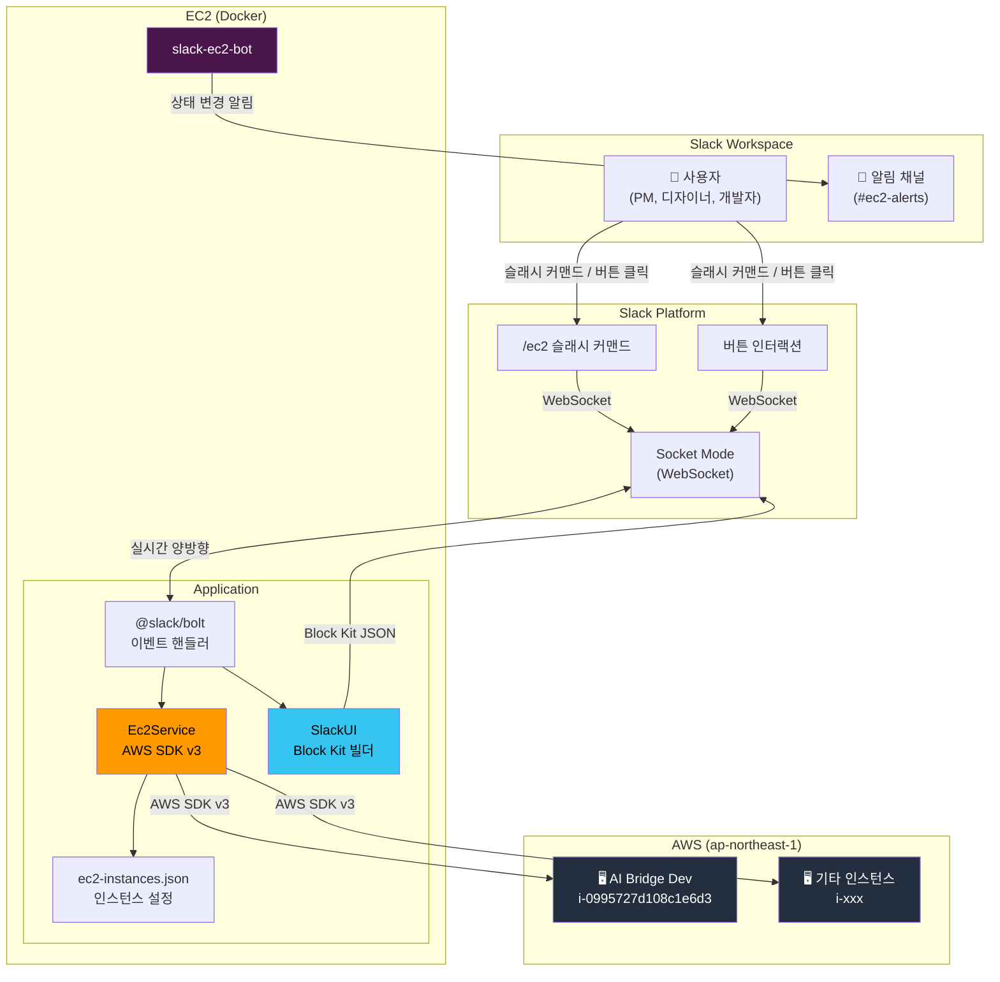

# Slack EC2 관리 봇 — 개요

> **프로젝트**: `slack-ec2-bot` | **레포**: `meeta-inc/meeta-dev-tools` | **이슈**: [#14](https://github.com/meeta-inc/meeta-dev-tools/issues/14)

---

## 1. 프로젝트 배경

### 현재 상황

EC2 인스턴스(AI Bridge Dev 등) 관리는 다음 두 가지 방법으로만 가능합니다:

| 방법 | 대상 | 한계 |
|------|------|------|
| Claude Code `/ec2` 스킬 | 개발자 | CLI 환경 필수, Claude Code 설치 필요 |
| AWS 콘솔 | IAM 계정 보유자 | IAM 발급 절차, 높은 러닝커브 |

### 문제

- **PM, 디자이너** 등 비개발 직군도 개발 서버를 시작/중지해야 하는 상황이 빈번
- 매번 개발자에게 "서버 켜줘" 요청 → 불필요한 커뮤니케이션 오버헤드
- AWS 콘솔 접근은 보안 정책상 최소 인원에게만 부여

### 해결책

**Slack에서 버튼 클릭 또는 `/ec2` 슬래시 커맨드**로 EC2를 제어하는 봇을 구현합니다.

- 별도 설치 없이 Slack만 있으면 사용 가능
- 직관적인 UI (버튼, 드롭다운)
- 권한 제어로 안전한 운영

---

## 2. 왜 Slack 봇인가

### 대안 비교

| 방안 | 장점 | 단점 | 판정 |
|------|------|------|------|
| **Slack 봇** | 별도 앱 불필요, 팀 전원 접근 가능, 감사 로그 자연 생성 | Slack 의존성 | **채택** |
| 웹 대시보드 | 자유로운 UI | 별도 인증/호스팅 필요, 접근 URL 관리 | 과잉 |
| Claude Code 스킬 확장 | 기존 인프라 활용 | 비개발자 사용 불가 | 대상 미스매치 |
| AWS 콘솔 IAM 확대 | AWS 네이티브 | 보안 위험, 교육 비용 | 보안 리스크 |

### Slack 봇의 이점

1. **접근성**: 팀 전원이 이미 Slack을 사용 중
2. **가시성**: 채널에 상태 변경 알림 → 누가 언제 서버를 켰는지 투명하게 공유
3. **안전성**: 확인 다이얼로그, 채널/사용자 기반 권한 제어
4. **일관성**: `slack-attendance-bot`과 동일한 기술 스택·패턴 → 유지보수 용이

---

## 3. 대상 사용자

| 역할 | 주요 사용 시나리오 |
|------|-------------------|
| PM | 데모 전 개발 서버 시작, 퇴근 시 서버 중지 |
| 디자이너 | UI 확인을 위해 개발 환경 기동 |
| QA | 테스트 환경 시작/중지 |
| 개발자 | Slack에서 빠르게 상태 확인 및 제어 (CLI 대체) |

---

## 4. 주요 기능

### 4.1 슬래시 커맨드

| 커맨드 | 설명 |
|--------|------|
| `/ec2` | 인스턴스 목록 + 상태 + 시작/중지 버튼 표시 |
| `/ec2 status` | 전체 인스턴스 상태 요약 |

### 4.2 버튼 인터랙션

- **시작 버튼** → 확인 다이얼로그 → EC2 시작 → 결과 메시지
- **중지 버튼** → 확인 다이얼로그 → EC2 중지 → 결과 메시지
- **새로고침 버튼** → 최신 상태로 메시지 업데이트

### 4.3 채널 알림

- EC2 상태 변경 시 지정 채널에 자동 알림
- 포맷: `@사용자 님이 AI Bridge Dev (i-xxx) 를 시작했습니다`

---

## 5. 기술 스택

| 항목 | 선택 | 버전 | 이유 |
|------|------|------|------|
| 런타임 | Node.js | 18+ | `slack-attendance-bot` 통일 |
| 프레임워크 | `@slack/bolt` | ^3.15.0 | 기존 봇과 동일, Socket Mode 지원 |
| 통신 방식 | Socket Mode | — | 공용 URL 불필요, NAT/방화벽 뒤에서도 동작 |
| AWS SDK | `@aws-sdk/client-ec2` | v3 | 모듈식 SDK, 트리셰이킹 가능 |
| 설정 관리 | `dotenv` | ^16.x | 환경변수 기반 |
| 컨테이너 | Docker | — | 기존 EC2 인프라에 배포 |

---

## 6. 시스템 아키텍처

### 데이터 흐름

1. 사용자가 Slack에서 `/ec2` 입력 또는 버튼 클릭
2. Slack Platform이 Socket Mode(WebSocket)로 봇에 이벤트 전달
3. `@slack/bolt`가 이벤트를 수신하여 핸들러 실행
4. `Ec2Service`가 AWS SDK v3로 EC2 API 호출
5. `SlackUI`가 결과를 Block Kit JSON으로 변환
6. Socket Mode를 통해 사용자에게 응답 전송
7. 상태 변경 시 알림 채널에 메시지 게시

---

## 7. 참조 프로젝트

### `slack-attendance-bot` (동일 레포)

`slack-ec2-bot`은 `slack-attendance-bot`의 아키텍처 패턴을 따릅니다:

| 패턴 | 설명 |
|------|------|
| Socket Mode | 공용 URL 없이 WebSocket으로 Slack 연결 |
| 서비스 레이어 | `Ec2Service` ← `AttendanceManager` 패턴 참조 |
| UI 빌더 | `SlackUI` ← Block Kit 컴포넌트 빌더 패턴 참조 |
| 의존성 주입 | `index.js`에서 서비스 인스턴스 생성 후 주입 |
| Docker 배포 | `node:18-alpine` 기반 컨테이너 |

### `.claude/commands/ec2.md` (AI Bridge Workspace)

현재 Claude Code `/ec2` 스킬의 동작을 Slack 봇으로 옮기는 것이 핵심:

- AWS 프로파일: `meeta-ai-navi-dev`
- 리전: `ap-northeast-1`
- 인스턴스 설정: `.claude/ec2-instances.json` 형식 → `ec2-instances.json`으로 계승
- 액션: `start`, `stop`, `status` → 슬래시 커맨드 + 버튼으로 구현

---

## 8. 관련 문서

| 문서 | 설명 |
|------|------|
| [02-detailed-design.md](./02-detailed-design.md) | 모듈별 상세 구현 설계 |
| [03-deployment.md](./03-deployment.md) | 배포 및 운영 가이드 |
