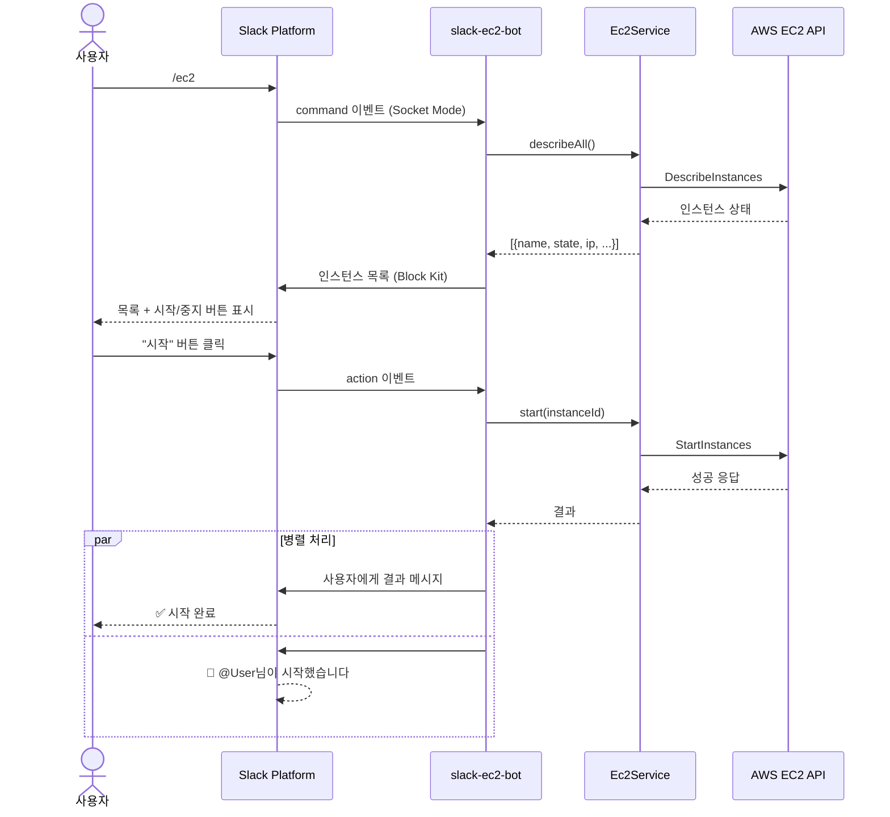
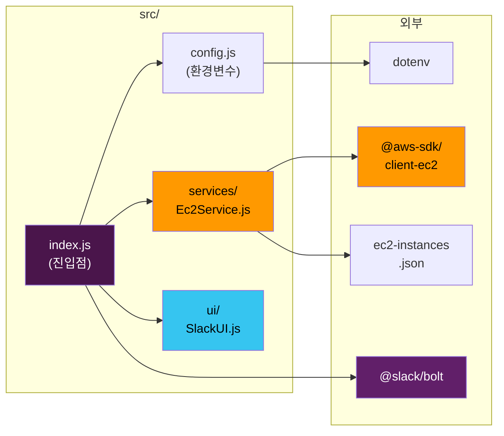
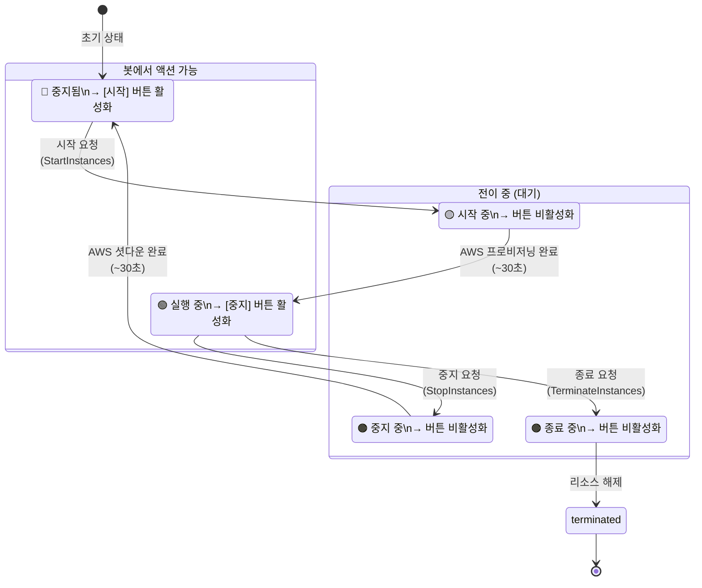
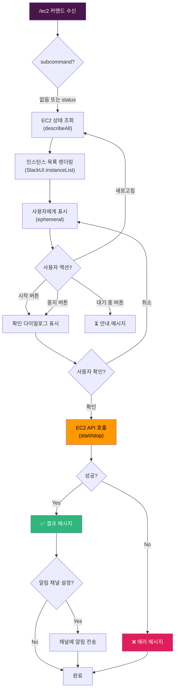

# Slack EC2 관리 봇 — 상세 구현 설계

> **프로젝트**: `slack-ec2-bot` | **레포**: `meeta-inc/meeta-dev-tools` | **이슈**: [#14](https://github.com/meeta-inc/meeta-dev-tools/issues/14)

---

## 1. 디렉토리 구조

```
slack-ec2-bot/
├── src/
│   ├── index.js              # 앱 진입점 — Bolt 초기화, 핸들러 등록
│   ├── services/
│   │   └── Ec2Service.js     # AWS EC2 API 래핑 (start, stop, describe)
│   ├── ui/
│   │   └── SlackUI.js        # Block Kit UI 빌더 (목록, 확인, 결과)
│   └── config.js             # 환경변수 로드 및 검증
├── ec2-instances.json        # 관리 대상 인스턴스 목록
├── package.json
├── Dockerfile
├── .env.example
└── README.md
```

---

## 2. Slack App Manifest

```yaml
display_information:
  name: EC2 Manager
  description: EC2 인스턴스 시작/중지 관리 봇
  background_color: "#232F3E"

features:
  bot_user:
    display_name: ec2-bot
    always_online: true
  slash_commands:
    - command: /ec2
      description: EC2 인스턴스 관리
      usage_hint: "[status]"
      should_escape: false

oauth_config:
  scopes:
    bot:
      - commands           # 슬래시 커맨드 수신
      - chat:write         # 메시지 전송
      - chat:write.public  # 공개 채널에 메시지 전송

settings:
  socket_mode_enabled: true
  org_deploy_enabled: false
  token_rotation_enabled: false
```

---

## 3. 모듈별 상세 설계

### 3.1 `src/config.js` — 설정 관리

```javascript
require('dotenv').config();

const config = {
  slack: {
    botToken: process.env.SLACK_BOT_TOKEN,        // xoxb-...
    signingSecret: process.env.SLACK_SIGNING_SECRET,
    appToken: process.env.SLACK_APP_TOKEN,        // xapp-... (Socket Mode)
  },
  aws: {
    region: process.env.AWS_REGION || 'ap-northeast-1',
    // 자격증명은 환경변수 또는 IAM Role로 자동 해결
  },
  app: {
    alertChannelId: process.env.ALERT_CHANNEL_ID, // 알림 채널
    allowedChannelIds: process.env.ALLOWED_CHANNEL_IDS?.split(',') || [],
    port: parseInt(process.env.PORT, 10) || 3000,
  },
};

// 필수 환경변수 검증
const required = ['SLACK_BOT_TOKEN', 'SLACK_SIGNING_SECRET', 'SLACK_APP_TOKEN'];
for (const key of required) {
  if (!process.env[key]) {
    throw new Error(`필수 환경변수 누락: ${key}`);
  }
}

module.exports = config;
```

### 3.2 `src/services/Ec2Service.js` — AWS EC2 서비스

```javascript
const { EC2Client, DescribeInstancesCommand,
        StartInstancesCommand, StopInstancesCommand } = require('@aws-sdk/client-ec2');
const instances = require('../../ec2-instances.json');

class Ec2Service {
  constructor(config) {
    this.client = new EC2Client({ region: config.aws.region });
    this.instances = instances; // [{id, name, description}]
  }

  // 전체 인스턴스 상태 조회
  async describeAll() {
    const instanceIds = this.instances.map(i => i.id);
    const command = new DescribeInstancesCommand({
      InstanceIds: instanceIds,
    });

    const response = await this.client.send(command);
    const statusMap = new Map();

    for (const reservation of response.Reservations) {
      for (const instance of reservation.Instances) {
        statusMap.set(instance.InstanceId, {
          state: instance.State.Name,         // running | stopped | ...
          type: instance.InstanceType,
          publicIp: instance.PublicIpAddress || null,
          privateIp: instance.PrivateIpAddress,
          launchTime: instance.LaunchTime,
        });
      }
    }

    // 설정 파일의 이름/설명과 AWS 상태를 병합
    return this.instances.map(inst => ({
      ...inst,
      ...(statusMap.get(inst.id) || { state: 'unknown' }),
    }));
  }

  // 인스턴스 시작
  async start(instanceId) {
    const command = new StartInstancesCommand({ InstanceIds: [instanceId] });
    const response = await this.client.send(command);
    return response.StartingInstances[0];
  }

  // 인스턴스 중지
  async stop(instanceId) {
    const command = new StopInstancesCommand({ InstanceIds: [instanceId] });
    const response = await this.client.send(command);
    return response.StoppingInstances[0];
  }

  // ID로 인스턴스 메타 조회
  findById(instanceId) {
    return this.instances.find(i => i.id === instanceId);
  }
}

module.exports = Ec2Service;
```

### 3.3 `src/ui/SlackUI.js` — Block Kit UI 빌더

```javascript
class SlackUI {
  // 인스턴스 목록 메시지 (슬래시 커맨드 응답)
  instanceList(instances) {
    const blocks = [
      {
        type: 'header',
        text: { type: 'plain_text', text: 'EC2 인스턴스 관리', emoji: true },
      },
      { type: 'divider' },
    ];

    for (const inst of instances) {
      const stateEmoji = this._stateEmoji(inst.state);
      const ip = inst.publicIp || inst.privateIp || '-';

      blocks.push({
        type: 'section',
        text: {
          type: 'mrkdwn',
          text: [
            `${stateEmoji} *${inst.name}*`,
            `상태: \`${inst.state}\` | IP: \`${ip}\``,
            `ID: \`${inst.id}\``,
          ].join('\n'),
        },
        accessory: this._actionButton(inst),
      });
    }

    // 새로고침 버튼
    blocks.push(
      { type: 'divider' },
      {
        type: 'actions',
        elements: [{
          type: 'button',
          text: { type: 'plain_text', text: '새로고침', emoji: true },
          action_id: 'ec2_refresh',
        }],
      }
    );

    return { blocks };
  }

  // 확인 다이얼로그 (시작/중지 전)
  confirmDialog(action, instance) {
    const actionText = action === 'start' ? '시작' : '중지';
    return {
      title: { type: 'plain_text', text: `EC2 ${actionText} 확인` },
      text: {
        type: 'mrkdwn',
        text: `*${instance.name}* (\`${instance.id}\`)을(를) ${actionText}하시겠습니까?`,
      },
      confirm: { type: 'plain_text', text: `${actionText}` },
      deny: { type: 'plain_text', text: '취소' },
      style: action === 'stop' ? 'danger' : 'primary',
    };
  }

  // 결과 메시지
  resultMessage(action, instance, success, error = null) {
    const actionText = action === 'start' ? '시작' : '중지';
    if (success) {
      return {
        text: `✅ *${instance.name}* (\`${instance.id}\`) ${actionText} 요청 완료`,
        replace_original: false,
      };
    }
    return {
      text: `❌ *${instance.name}* ${actionText} 실패: ${error}`,
      replace_original: false,
    };
  }

  // 채널 알림 메시지
  alertMessage(userId, action, instance) {
    const actionText = action === 'start' ? '시작' : '중지';
    return {
      text: `🔔 <@${userId}>님이 *${instance.name}* (\`${instance.id}\`)을(를) ${actionText}했습니다.`,
    };
  }

  // 상태별 이모지
  _stateEmoji(state) {
    const map = {
      running: '🟢', stopped: '🔴', pending: '🟡',
      'shutting-down': '🟠', stopping: '🟠', terminated: '⚫',
    };
    return map[state] || '⚪';
  }

  // 상태별 액션 버튼 (running → 중지, stopped → 시작)
  _actionButton(instance) {
    if (instance.state === 'running') {
      return {
        type: 'button',
        text: { type: 'plain_text', text: '중지', emoji: true },
        style: 'danger',
        action_id: `ec2_stop_${instance.id}`,
        confirm: this.confirmDialog('stop', instance),
      };
    }
    if (instance.state === 'stopped') {
      return {
        type: 'button',
        text: { type: 'plain_text', text: '시작', emoji: true },
        style: 'primary',
        action_id: `ec2_start_${instance.id}`,
        confirm: this.confirmDialog('start', instance),
      };
    }
    // 전이 중(pending, stopping 등)이면 비활성 버튼
    return {
      type: 'button',
      text: { type: 'plain_text', text: '대기 중...', emoji: true },
      action_id: `ec2_wait_${instance.id}`,
    };
  }
}

module.exports = SlackUI;
```

### 3.4 `src/index.js` — 앱 진입점

```javascript
const { App } = require('@slack/bolt');
const config = require('./config');
const Ec2Service = require('./services/Ec2Service');
const SlackUI = require('./ui/SlackUI');

const app = new App({
  token: config.slack.botToken,
  signingSecret: config.slack.signingSecret,
  socketMode: true,
  appToken: config.slack.appToken,
  port: config.app.port,
});

const ec2Service = new Ec2Service(config);
const slackUI = new SlackUI();

// --- 슬래시 커맨드 ---
app.command('/ec2', async ({ command, ack, respond }) => {
  await ack();

  const subcommand = command.text?.trim().toLowerCase();

  const instances = await ec2Service.describeAll();
  const message = slackUI.instanceList(instances);
  await respond({ ...message, response_type: 'ephemeral' });
});

// --- 시작/중지 버튼 ---
app.action(/^ec2_(start|stop)_(.+)$/, async ({ action, ack, respond, body, client }) => {
  await ack();

  const [, actionType, instanceId] = action.action_id.match(/^ec2_(start|stop)_(.+)$/);
  const instance = ec2Service.findById(instanceId);

  try {
    if (actionType === 'start') {
      await ec2Service.start(instanceId);
    } else {
      await ec2Service.stop(instanceId);
    }

    // 사용자에게 결과 전송
    const result = slackUI.resultMessage(actionType, instance, true);
    await respond(result);

    // 채널 알림
    if (config.app.alertChannelId) {
      const alert = slackUI.alertMessage(body.user.id, actionType, instance);
      await client.chat.postMessage({
        channel: config.app.alertChannelId,
        ...alert,
      });
    }
  } catch (error) {
    const result = slackUI.resultMessage(actionType, instance, false, error.message);
    await respond(result);
  }
});

// --- 새로고침 ---
app.action('ec2_refresh', async ({ ack, respond }) => {
  await ack();
  const instances = await ec2Service.describeAll();
  const message = slackUI.instanceList(instances);
  await respond({ ...message, replace_original: true });
});

// --- 대기 중 버튼 (no-op) ---
app.action(/^ec2_wait_/, async ({ ack, respond }) => {
  await ack();
  await respond({
    text: '⏳ 인스턴스 상태가 전이 중입니다. 잠시 후 새로고침 해주세요.',
    replace_original: false,
  });
});

// --- 앱 시작 ---
(async () => {
  await app.start();
  console.log('⚡️ EC2 관리 봇이 실행 중입니다!');
})();
```

### 3.5 `ec2-instances.json` — 인스턴스 설정

기존 `.claude/ec2-instances.json`과 동일한 형식을 사용합니다:

```json
[
  {
    "id": "i-0995727d108c1e6d3",
    "name": "AI Bridge Dev",
    "description": "AI Bridge 통합 개발 환경 (Dev Container)"
  }
]
```

인스턴스 추가 시 이 파일에 항목을 추가하면 됩니다. 코드 변경 없이 설정만으로 관리 대상을 확장할 수 있습니다.

---

## 4. Mermaid 다이어그램

### 4.1 시퀀스 다이어그램 — `/ec2` 커맨드 → 시작/중지 흐름



### 4.2 컴포넌트 의존성 다이어그램



### 4.3 EC2 상태 전이 다이어그램



### 4.4 인터랙션 플로우차트



---

## 5. 슬래시 커맨드 설계

### 5.1 `/ec2` (기본)

| 항목 | 값 |
|------|-----|
| 트리거 | `/ec2` 또는 `/ec2 status` |
| 응답 타입 | `ephemeral` (본인만 보임) |
| 동작 | 전체 인스턴스 상태 조회 → Block Kit 목록 |
| 타임아웃 | 3초 내 `ack()`, 이후 `respond()`로 결과 전달 |

### 5.2 향후 확장 가능 서브커맨드

| 서브커맨드 | 설명 | 우선순위 |
|-----------|------|---------|
| `/ec2 start <name>` | 이름으로 바로 시작 | P2 |
| `/ec2 stop <name>` | 이름으로 바로 중지 | P2 |
| `/ec2 schedule` | 자동 시작/중지 스케줄 | P3 |

---

## 6. 버튼 인터랙션 설계

### 6.1 action_id 컨벤션

```
ec2_{action}_{instanceId}
```

| action_id 패턴 | 설명 |
|----------------|------|
| `ec2_start_{id}` | 시작 버튼 |
| `ec2_stop_{id}` | 중지 버튼 |
| `ec2_wait_{id}` | 전이 중 (no-op) |
| `ec2_refresh` | 새로고침 |

### 6.2 확인 다이얼로그

모든 시작/중지 버튼에는 Slack 네이티브 `confirm` 객체를 부착합니다:
- **시작**: `style: 'primary'` (파란색 확인 버튼)
- **중지**: `style: 'danger'` (빨간색 확인 버튼)

---

## 7. 보안 설계

### 7.1 채널 제한

```javascript
// 허용된 채널에서만 커맨드 실행
app.command('/ec2', async ({ command, ack, respond }) => {
  await ack();

  if (config.app.allowedChannelIds.length > 0 &&
      !config.app.allowedChannelIds.includes(command.channel_id)) {
    return respond({
      text: '⛔ 이 채널에서는 EC2 관리 커맨드를 사용할 수 없습니다.',
      response_type: 'ephemeral',
    });
  }

  // ...정상 처리
});
```

### 7.2 AWS 권한 최소화

봇에 부여하는 IAM 정책은 다음 액션만 허용합니다:

```json
{
  "Version": "2012-10-17",
  "Statement": [
    {
      "Effect": "Allow",
      "Action": [
        "ec2:DescribeInstances",
        "ec2:DescribeInstanceStatus",
        "ec2:StartInstances",
        "ec2:StopInstances"
      ],
      "Resource": "*",
      "Condition": {
        "StringEquals": {
          "ec2:ResourceTag/ManagedBy": "slack-ec2-bot"
        }
      }
    }
  ]
}
```

> **참고**: `Condition`은 태그 기반 리소스 제한입니다. 관리 대상 EC2에 `ManagedBy=slack-ec2-bot` 태그를 추가해야 합니다.

### 7.3 감사 로그

모든 시작/중지 액션은 알림 채널에 자동 기록됩니다:
- 누가 (`<@userId>`)
- 무엇을 (인스턴스명, ID)
- 언제 (메시지 타임스탬프)

---

## 8. 에러 처리

| 상황 | 처리 |
|------|------|
| AWS 자격증명 오류 | 봇 시작 실패 → 로그 출력 |
| EC2 API 호출 실패 | 사용자에게 에러 메시지, 알림 채널에 기록 |
| 인스턴스 ID 불일치 | `findById()` → null → "인스턴스를 찾을 수 없습니다" |
| Slack API 오류 | `app.error()` 글로벌 핸들러에서 캐치 |
| 3초 타임아웃 | `ack()` 즉시 호출 → `respond()`로 비동기 응답 |

```javascript
// 글로벌 에러 핸들러
app.error(async (error) => {
  console.error('앱 에러:', error);
});
```

---

## 9. 의존성 목록 (`package.json`)

```json
{
  "name": "slack-ec2-bot",
  "version": "1.0.0",
  "description": "Slack에서 EC2 인스턴스를 관리하는 봇",
  "main": "src/index.js",
  "scripts": {
    "start": "node src/index.js",
    "dev": "node --watch src/index.js"
  },
  "dependencies": {
    "@slack/bolt": "^3.15.0",
    "@aws-sdk/client-ec2": "^3.500.0",
    "dotenv": "^16.3.1"
  },
  "engines": {
    "node": ">=18.0.0"
  }
}
```

---

## 10. 관련 문서

| 문서 | 설명 |
|------|------|
| [01-overview.md](./01-overview.md) | 프로젝트 개요 및 배경 |
| [03-deployment.md](./03-deployment.md) | 배포 및 운영 가이드 |
